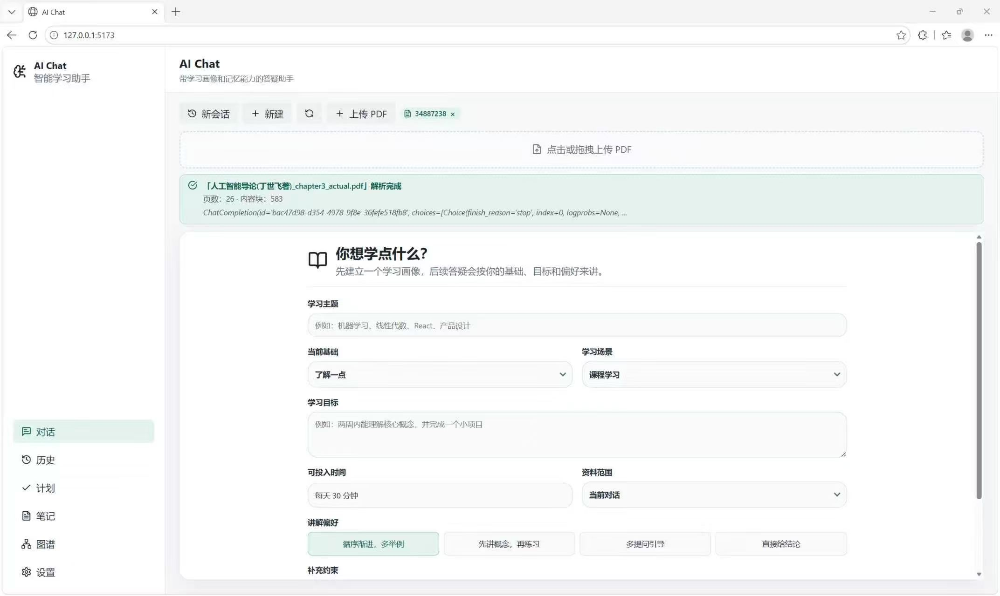
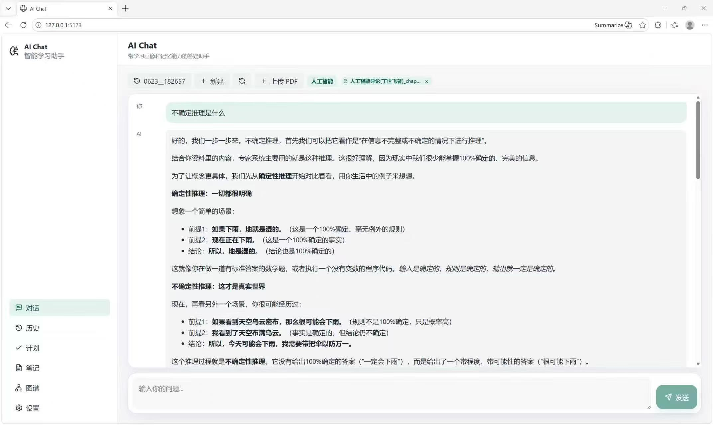
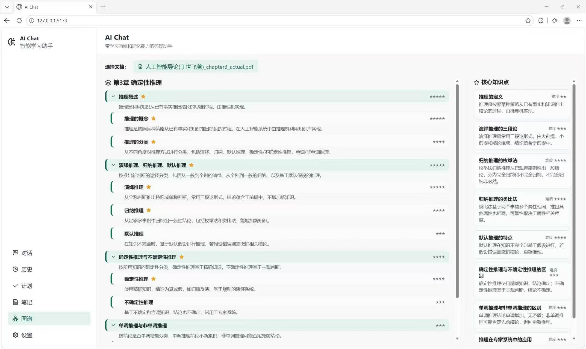
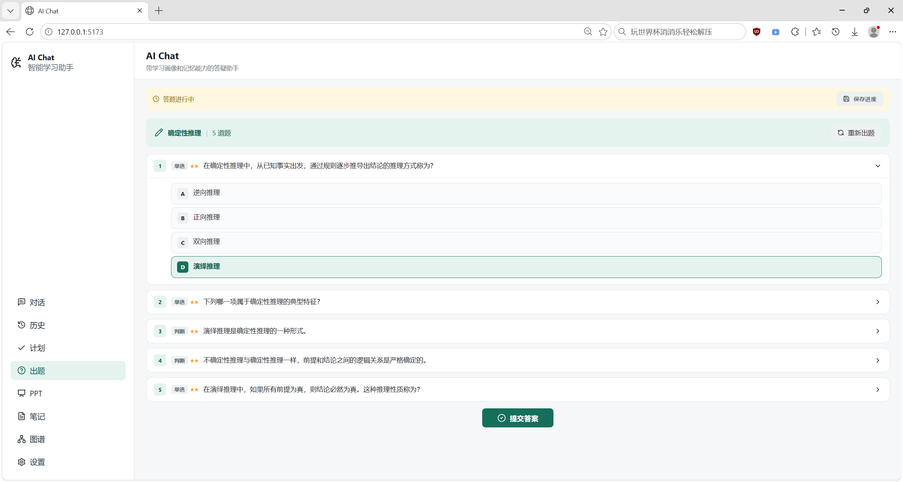
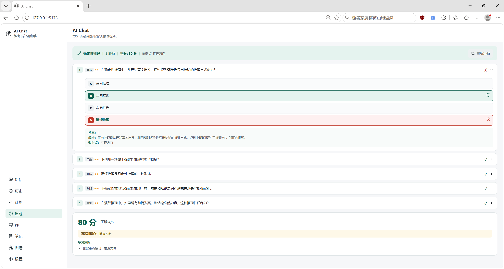
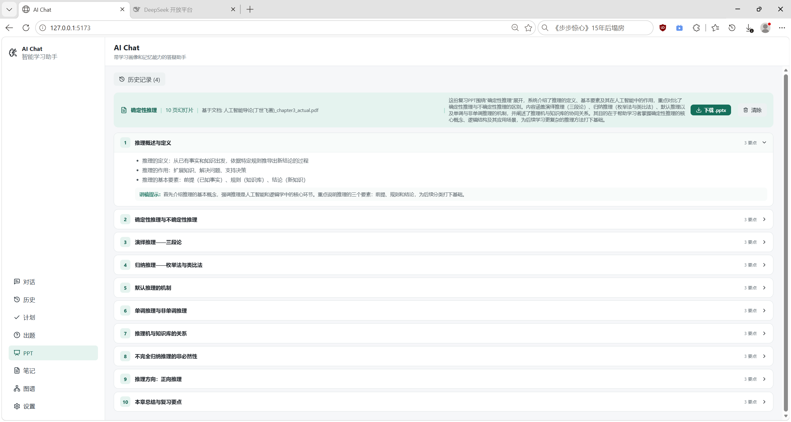
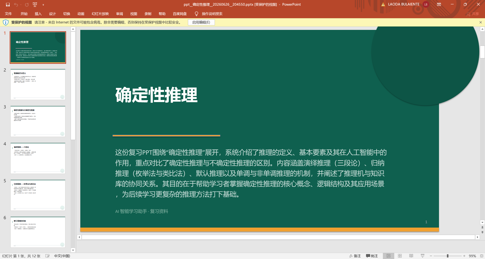
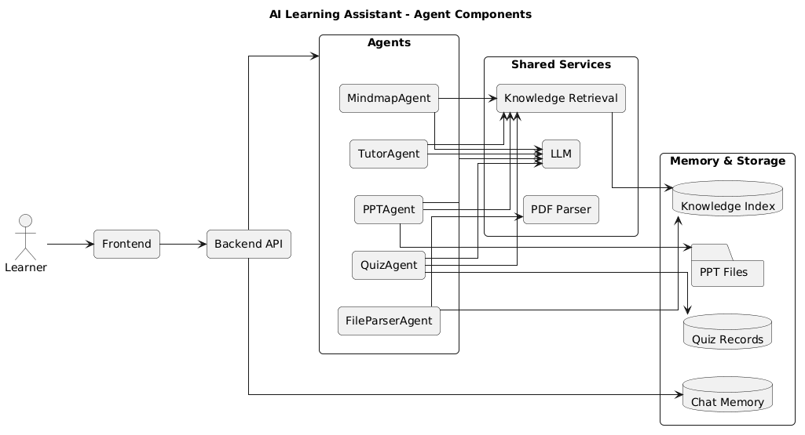

# AI Learning Assistant

AI Learning Assistant is a multi-agent study workspace that combines conversational tutoring, document-based retrieval, quiz generation, study planning, mind maps, and PowerPoint generation in one local web app.

The project is built with a FastAPI backend and a React + Vite frontend. The backend organizes learning capabilities as agents and shared services, while the frontend exposes them as focused study workflows.

## Core Features

### Personalized AI Chat

- Streams assistant responses from the backend to the browser.
- Starts each new learner with a learning profile, including topic, goal, level, available time, and constraints.
- Saves chat sessions with message history, profile data, and conversation summaries.
- Retrieves relevant chunks from uploaded documents and injects them into chat context for RAG-style answers.





### PDF Knowledge Base

- Uploads PDF learning materials from the chat workspace.
- Parses PDFs through MinerU when `MINERU_API_KEY` is configured.
- Splits parsed content into searchable knowledge chunks.
- Stores document metadata, chunk indexes, and generated learning artifacts.
- Supports document listing, detail lookup, and deletion.

### Knowledge Mind Map

- Generates a structured mind map for an uploaded document.
- Shows hierarchical concepts, summaries, importance markers, and key points.
- Caches generated mind maps and allows forced regeneration.
- Reuses mind map key points as optional input for PPT generation.



### Quiz Generator

- Generates practice questions from a topic and uploaded knowledge bases.
- Supports multiple question modes in the UI, including single choice, multiple choice, true/false, and fill-in-the-blank.
- Saves quiz sessions automatically.
- Allows learners to save in-progress answers, resume previous sessions, submit answers, and view scoring.
- Produces weak-point analysis and review suggestions after evaluation.





### Study Plan Generator

- Builds a personalized multi-day study plan from the learner profile.
- Uses recent quiz weak points to prioritize review content.
- Searches uploaded materials for reference content related to the study topic.
- Returns a day-by-day timeline with topic, duration, content tasks, goals, and activity type.

### PPT Generation

- Generates a slide outline and `.pptx` file for a selected topic.
- Can use uploaded document context and mind map key points.
- Saves PPT generation sessions for later review.
- Provides download endpoints for generated PowerPoint files.





### History Management

- Lists saved chat sessions, quiz sessions, and PPT sessions.
- Loads previous work into the relevant view.
- Supports deleting saved sessions and uploaded documents.

## Agent and Service Architecture

The backend uses a small agent runtime layer under `backend/app/agents` and `backend/app/core`.

Current agents include:

- `FileParserAgent`: parses uploaded PDF content and stores knowledge artifacts.
- `MindmapAgent`: turns document knowledge into a hierarchical concept map.
- `QuizAgent`: creates practice questions from topic and knowledge context.
- `PPTAgent`: creates slide outlines and builds `.pptx` files.
- `TutorAgent`: provides guided tutoring behavior.

Shared services include:

- `LLMService` for model calls and streaming responses.
- `KnowledgeService` for document storage, chunk search, and knowledge indexes.
- `EmbeddingService` for vector-style retrieval support.
- `EntityGraphService` for document concept graph data.
- `ProfileService` for learner profile normalization and system prompts.
- `MinerUClient` for external PDF parsing.
- Quiz and PPT session stores for generated artifacts and progress.

## Main Application Views

The React frontend is organized around these views:

- Chat: profile setup, streamed tutor chat, PDF upload, uploaded document chips, and session switching.
- History: saved chat session browsing and deletion.
- Study Plan: personalized learning schedule generation.
- Quiz: question generation, answering, progress saving, evaluation, and quiz history.
- PPT: slide deck generation, document/mind-map assisted generation, session history, and download.
- Knowledge Graph: document selection, cached mind map display, key points, and regeneration.

## Tech Stack

- Backend: Python, FastAPI, Pydantic Settings, OpenAI-compatible client, python-pptx.
- Retrieval and knowledge processing: NumPy, scikit-learn, jieba, NetworkX, sentence-transformers.
- Frontend: React 18, Vite, lucide-react, react-markdown, remark-gfm, remark-math, rehype-katex.
- Document parsing: MinerU API integration.

## Project Structure

```text
backend/
  main.py                     FastAPI routes and application entry point
  config.py                   Environment-based settings
  memory.py                   Chat session persistence
  context.py                  Chat context and memory management
  app/
    agents/                   Agent implementations and contracts
    core/                     Agent runtime, result, and pipeline primitives
    services/                 LLM, knowledge, profile, parser, quiz, and PPT services

frontend/
  src/
    App.jsx                   Main shell and navigation
    api.js                    API helper
    components/               Shared UI components
    views/                    Chat, history, plan, quiz, PPT, and mind map views
  package.json                Frontend scripts and dependencies

docs/                         Development and implementation notes
start.bat                     Windows launcher for backend and frontend
```

## Running Locally

Create `backend/.env` with your model and parser keys, then start the backend and frontend:

```powershell
cd backend
python -m venv .venv
.\.venv\Scripts\Activate.ps1
pip install -r requirements.txt
uvicorn main:app --reload --host 127.0.0.1 --port 8000
```

```powershell
cd frontend
npm install
npm run dev
```

Open `http://127.0.0.1:5173`, or run `start.bat` on Windows to start both services.

## Development Checks

Backend syntax check:

```powershell
python -m compileall -q backend\app
```

Frontend build:

```powershell
cd frontend
npm run build
```

## Diagrams



## Acknowledgement

All source code will be submitted after the Software Cup competition ends.
