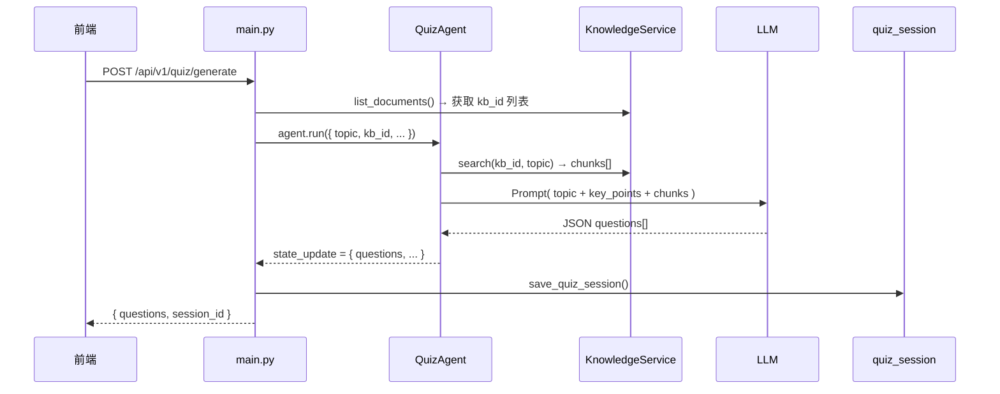
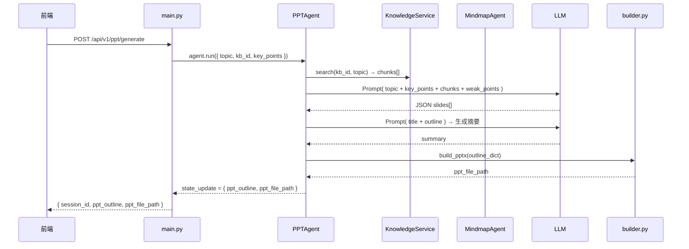

# QuizAgent & PPTAgent 实现文档

## 1. 概述

QuizAgent 和 PPTAgent 是 AI 学习助手中的两个核心功能模块，均集成在以下系统流程中：

```
用户上传 PDF → FileParserAgent → KnowledgeService（知识库）
                                    ├── QuizAgent  → 出题 + 批改
                                    ├── PPTAgent   → 生成复习 PPT
                                    ├── MindmapAgent → 思维导图
                                    └── TutorAgent → 对话答疑
```

| Agent | 定位 | 输出 |
|-------|------|------|
| **QuizAgent** | 基于知识库生成练习题并自动批改 | JSON 题目列表 + 评估报告 |
| **PPTAgent** | 基于知识库和思维导图生成复习幻灯片 | JSON 大纲 + .pptx 文件 |

---

## 2. 后端架构

### 2.1 目录结构

```text
backend/
├── app/
│   ├── agents/
│   │   ├── quiz/                          # QuizAgent
│   │   │   ├── __init__.py
│   │   │   ├── agent.py                   # 核心流程
│   │   │   ├── models.py                  # 数据模型
│   │   │   ├── prompts.py                 # LLM Prompt 模板
│   │   │   ├── evaluator.py               # 批改引擎
│   │   │   └── test_agent.py              # 本地验证脚本
│   │   │
│   │   ├── ppt/                           # PPTAgent
│   │   │   ├── __init__.py
│   │   │   ├── agent.py                   # 核心流程
│   │   │   ├── models.py                  # 数据模型
│   │   │   ├── prompts.py                 # LLM Prompt 模板
│   │   │   ├── builder.py                 # .pptx 文件构建器
│   │   │   └── test_agent.py              # 本地验证脚本
│   │   │
│   │   ├── base.py                        # BaseAgent 基类
│   │   └── config.py                      # AgentConfig 定义
│   │
│   └── services/
│       ├── knowledge.py                   # 知识库检索服务
│       ├── quiz_session.py                # 出题会话持久化
│       └── ppt_session.py                 # PPT 会话持久化
│
├── main.py                                # FastAPI 路由定义
└── memory.py                              # 对话历史持久化
```

### 2.2 Agent 通用设计

所有 Agent 继承自 `BaseAgent`，通过 `AgentConfig` 声明元信息：

```python
# app/agents/config.py
class AgentConfig:
    id: str                    # 唯一标识
    name: str                  # 可读名称
    role: str                  # 角色标签
    input_keys: list[str]      # 声明的输入字段
    output_keys: list[str]     # 声明的输出字段
    required_services: list[str]  # 依赖的服务
    priority: int              # 执行优先级
    enabled: bool              # 是否启用
    strict_inputs: bool        # 是否严格校验输入
```

Agent 的执行入口是统一的 `async def process(inputs, runtime) -> AgentResult`，不直接依赖外部 API 或数据库，通过 `runtime.get_service("knowledge")` 获取知识库服务。

### 2.3 数据库（持久化）设计

系统没有使用传统数据库，而是用 **JSON 文件持久化**：

| 文件 | 用途 |
|------|------|
| `data/knowledge/documents.json` | 文档元信息 |
| `data/knowledge/chunks.json` | 文本块内容 |
| `data/knowledge/vdb_{kb_id}.json` | 向量索引 |
| `data/knowledge/bm25_{kb_id}.json` | 关键词索引 |
| `data/sessions/*.json` | 对话历史 |
| `data/quiz_sessions/*.json` | 出题记录 |
| `data/ppt_sessions/*.json` | PPT 生成记录 |
| `data/ppt/*.pptx` | 生成的幻灯片文件 |

---

## 3. QuizAgent 实现

### 3.1 数据模型

```python
# app/agents/quiz/models.py
@dataclass
class QuizQuestion:
    id: str                        # 唯一标识，如 "q_1"
    type: str                      # single_choice | multiple_choice | fill_blank | true_false
    stem: str                      # 题干
    options: list[dict] | None     # 选项，选择题时存在
    answer: str                    # 正确答案
    explanation: str               # 解析
    knowledge_point: str           # 所属知识点
    difficulty: int                # 难度 1~5
    source: dict | None            # {"document_id": "...", "chunk_id": "..."}

@dataclass
class QuizEvaluation:
    score: float                   # 百分制得分
    correct_count: int             # 正确数
    total_count: int               # 总题数
    weak_points: list[str]         # 薄弱知识点列表
    suggestions: list[str]         # 复习建议
    details: list[dict]            # 逐题批改明细
```

### 3.2 LLM Prompt 设计

Prompt 定义在 `app/agents/quiz/prompts.py`：

```python
GENERATE_QUIZ_PROMPT = """你是一个学习出题助手。请根据以下资料生成 {question_count} 道题目。

题目类型要求：{question_types}

要求：
1. 题目必须基于资料内容，不能编造
2. 必须包含答案和解析
3. 标注每道题对应的知识点
4. 难度：{difficulty}
5. 返回格式为 JSON 数组

学习主题：{topic}
核心知识点：{key_points}
参考资料：{knowledge_context}
"""
```

核心设计：

- **输出格式约束**：要求在 JSON 数组中，便于后端直接 `json.loads()`
- **知识点标注**：每道题带 `knowledge_point`，用于后续统计薄弱点
- **source 字段**：标注题目来源的知识库文档和块 ID（Prompt 中已定义结构）

### 3.3 核心流程

````text
QuizAgent.process() 执行流程：

1. 检索知识库
   └─ 如果传了 knowledge_base_id
       └─ 调用 knowledge.search(kb_id, topic) → 返回相关文本块
       └─ 拼接为 knowledge_context

2. 准备 key_points
   └─ 从 MindmapAgent 产出的核心知识点中提取
   └─ 格式化为 "- 标题" 列表

3. 拼装 Prompt
   └─ 填充 question_count / question_types / difficulty / topic
   └─ 注入 knowledge_context 和 key_points

4. 调用 LLM
   └─ 执行 self.call_llm(runtime, prompt)
   └─ 获得响应文本

5. 解析 JSON
   └─ _parse_questions() 处理 markdown 包裹
   └─ 尝试 json.loads() 提取题目数组

6. 返回 AgentResult
   └─ state_update: { questions, quiz_session_id, quiz_metadata }
   └─ artifacts: [Artifact(type="quiz_questions")]
````

### 3.4 批改引擎

```python
# app/agents/quiz/evaluator.py
def evaluate_simple(questions, user_answers) -> QuizEvaluation:
    """纯逻辑批改，无需 LLM。"""
    for q in questions:
        is_correct = user_answer.strip().upper() == correct_answer.strip().upper()
        if not is_correct:
            weak_set.add(q["knowledge_point"])

    score = round(correct / total * 100, 1)
    suggestions = _generate_suggestions(weak_set)
    # → 生成建议如 ["建议重点复习：决策树"]

    return QuizEvaluation(score, correct_count, total_count, weak_points, suggestions, details)
```

### 3.5 API 路由

```python
# backend/main.py

class QuizGenerateRequest(BaseModel):
    topic: str = ""
    question_count: int = 5
    question_types: str = "选择题"
    difficulty: str = "中等"
    session_id: str = ""

@app.post("/api/v1/quiz/generate")
async def generate_quiz(req):
    # 1. 遍历所有已上传文档，收集 knowledge_base_ids
    # 2. 对每个 kb 调用 QuizAgent（topic + kb_id）
    # 3. 合并题目，截取请求数量
    # 4. 自动保存到 quiz_session（JSON）
    # 5. 返回 { questions, question_count, session_id }


class QuizEvaluateRequest(BaseModel):
    questions: list[dict] = []
    user_answers: dict[str, str] = {}
    session_id: str = ""

@app.post("/api/v1/quiz/evaluate")
async def evaluate_quiz(req):
    # 1. 调用 evaluate_simple() 批改
    # 2. 如果传了 session_id，自动保存完成状态
    # 3. 返回 { score, correct_count, weak_points, suggestions, details }
```

---

## 4. PPTAgent 实现

### 4.1 数据模型

```python
# app/agents/ppt/models.py
@dataclass
class Slide:
    title: str                     # 幻灯片标题
    bullets: list[str]             # 要点列表
    speaker_notes: str             # 讲稿提示
    source_chunks: list[str]       # 来源 chunk ID 列表

@dataclass
class PptOutline:
    title: str                     # PPT 总标题
    slides: list[Slide]            # 幻灯片列表
    slide_count: int               # 幻灯片数量
    topic: str                     # 学习主题
    summary: str                   # 整体摘要
```

### 4.2 LLM Prompt 设计

```python
# app/agents/ppt/prompts.py

GENERATE_PPT_OUTLINE_PROMPT = """你是一个学习复习材料制作助手。
请根据以下资料生成一份 PPT 复习大纲。

要求：
1. 大纲应覆盖所有核心知识点
2. 每张幻灯片包含标题、要点列表和讲稿提示
3. 结构合理，先概念后细节，循序渐进
4. 如果提供了答题评估结果，优先突出薄弱知识点
5. 返回 JSON 数组

学习主题：{topic}
幻灯片数量：{slide_count}
核心知识点：{key_points}
参考资料：{knowledge_context}
薄弱知识点：{weak_points}
"""
```

### 4.3 核心流程

````text
PPTAgent.process() 执行流程：

1. 检索知识库（同 QuizAgent）
   └─ 如果传了 knowledge_base_id → 搜索相关文本

2. 准备 key_points + weak_points
   └─ key_points 来自 MindmapAgent
   └─ weak_points 来自 QuizAgent 的评估结果

3. 调用 LLM 生成大纲
   └─ 拼装 GENERATE_PPT_OUTLINE_PROMPT
   └─ 返回 JSON 数组：[{ title, bullets, speaker_notes, source_chunks }]

4. 生成整体摘要
   └─ 调用 LLM 第二次 → 生成 2-3 句话的 PPT 摘要

5. 构建 PptOutline 对象
   └─ 合并 title / slides / summary

6. 生成 .pptx 文件
   └─ 调用 build_pptx(outline_dict, "data/ppt")
   └─ 返回 .pptx 文件路径

7. 返回 AgentResult
   └─ state_update: { ppt_artifact_id, ppt_outline, ppt_file_path }
   └─ artifacts: [Artifact(type="ppt_outline")]
````

### 4.4 .pptx 构建器

`builder.py` 使用 `python-pptx` 库构建视觉效果丰富的幻灯片。

```python
# app/agents/ppt/builder.py

def build_pptx(outline, output_dir="data/ppt") -> str:
    prs = Presentation()
    prs.slide_width = Inches(13.333)
    prs.slide_height = Inches(7.5)

    # 第一页：封面（深绿色背景 + 装饰圆 + 金色分隔线）
    _add_title_slide(prs, title, summary)

    # 中间页：内容页（白色背景 + 绿色装饰条 + 双列布局）
    for slide_data in slides_data:
        _add_content_slide(prs, slide_data, index, total)

    # 最后一页：结束页（同封面风格 + 鼓励语）
    _add_closing_slide(prs, title)

    # 保存到 data/ppt/ 目录
    prs.save(filename)
    return absolute_path
```

视觉设计：

| 元素 | 封面页 | 内容页 | 结束页 |
|------|--------|--------|--------|
| 背景色 | 深绿色 `#0F604F` | 白色 | 深绿色 |
| 装饰 | 右上装饰圆 + 底部金色条 | 顶部绿条 + 左侧标识条 + 右下装饰圆 | 左上装饰圆 + 金色条 |
| 文字 | 白色大标题 + 浅绿摘要 | 深色大标题 + 灰色正文 | 白色"复习完成" |
| 布局 | 居中 | ≥6 要点时自动双列 | 居中 |
| 页码 | 右下 | 右下 "X / 总页数" + 左下 "第X页" | 右下 |

### 4.5 API 路由

```python
# backend/main.py

class PptGenerateRequest(BaseModel):
    topic: str = ""
    slide_count: int = 10
    knowledge_base_id: str = ""
    key_points: list[dict] = []
    quiz_evaluation: dict = {}
    user_profile: dict = {}

@app.post("/api/v1/ppt/generate")
async def generate_ppt(req):
    # 1. 调用 PPTAgent
    # 2. 自动保存到 ppt_session
    # 3. 返回 { session_id, ppt_artifact_id, ppt_outline, ppt_file_path }
```

---

## 5. API 路由总览

| 方法 | 路由 | 功能 | 请求体 | 响应 |
|------|------|------|--------|------|
| `POST` | `/api/v1/quiz/generate` | 生成题目 | `{topic, question_count, question_types, difficulty}` | `{questions[], session_id}` |
| `POST` | `/api/v1/quiz/evaluate` | 批改答案 | `{questions[], user_answers{}, session_id}` | `{score, correct_count, weak_points[], suggestions[]}` |
| `GET` | `/api/v1/quiz/sessions` | 出题历史 | — | `{sessions[]}` |
| `GET` | `/api/v1/quiz/sessions/{id}` | 加载会话 | — | 完整会话数据 |
| `DELETE` | `/api/v1/quiz/sessions/{id}` | 删除 | — | `{status, session_id}` |
| `POST` | `/api/v1/quiz/sessions/{id}/save` | 保存进度 | `{topic, questions[], user_answers{}}` | `{status, session_id}` |
| `POST` | `/api/v1/ppt/generate` | 生成 PPT | `{topic, slide_count, knowledge_base_id, key_points[]}` | `{session_id, ppt_outline, ppt_file_path}` |
| `GET` | `/api/v1/ppt/sessions` | PPT 历史 | — | `{sessions[]}` |
| `GET` | `/api/v1/ppt/sessions/{id}` | 加载会话 | — | 完整会话数据 |
| `DELETE` | `/api/v1/ppt/sessions/{id}` | 删除 | — | `{status, session_id}` |
| `GET` | `/api/v1/ppt/{artifact_id}/download` | 下载 .pptx | — | 文件流 |

---

## 6. 前端实现

### 6.1 页面结构

```text
frontend/src/views/
├── QuizView.jsx              ← 出题页面
├── PlanView.jsx              ← PPT 页面
├── StudyPlanView.jsx         ← 学习计划页面
└── ...                        ← 其他页面
```

### 6.2 QuizView（出题页面）

**核心状态：**

```javascript
const [topic, setTopic] = useState("")             // 学习主题
const [questionCount, setQuestionCount] = useState(5)  // 题目数量
const [selectedTypes, setSelectedTypes] = useState(["single_choice", "true_false"])  // 题型
const [questions, setQuestions] = useState([])     // 题目列表
const [userAnswers, setUserAnswers] = useState({}) // 用户答案
const [submitted, setSubmitted] = useState(false)  // 是否已提交
const [evaluation, setEvaluation] = useState(null)  // 批改结果
const [sessionId, setSessionId] = useState("")     // 当前会话 ID
const [sessions, setSessions] = useState([])       // 历史记录列表
```

**交互流程：**

```
┌─────────────────────────────────────────────────────┐
│  输入主题 + 选择题型 + 设置数量                      │
│  [生成题目]                                         │
├─────────────────────────────────────────────────────┤
│  题目 1  [单选] ★★  题干内容...                    │
│  ├─ A. 选项文本              (点击展开详情)         │
│  ├─ B. 选项文本              (选择答案)             │
│  ├─ C. 选项文本                                     │
│  └─ D. 选项文本                                     │
│                                                     │
│  题目 2  [判断] ★   题干内容...                     │
│                                                     │
│  [保存进度]                         [提交答案]       │
├─────────────────────────────────────────────────────┤
│  得分: 80 分  |  正确 4/5  |  薄弱点: 决策树        │
│  复习建议:                                         │
│  · 建议重点复习决策树                                │
└─────────────────────────────────────────────────────┘
```

**API 调用链：**

1. `POST /api/v1/quiz/generate` → 生成题目
2. `POST /api/v1/quiz/sessions/{id}/save` → 保存进度
3. `POST /api/v1/quiz/evaluate` → 批改答案
4. `GET /api/v1/quiz/sessions` → 加载历史列表
5. `GET /api/v1/quiz/sessions/{id}` → 恢复之前的会话

### 6.3 PlanView（PPT 页面）

**核心状态：**

```javascript
const [topic, setTopic] = useState("")             // 学习主题
const [slideCount, setSlideCount] = useState(10)   // 幻灯片数量
const [result, setResult] = useState(null)          // 生成结果
const [expandedSlides, setExpandedSlides] = useState(new Set()) // 展开状态
const [docs, setDocs] = useState([])               // 已上传文档列表
const [selectedDoc, setSelectedDoc] = useState(null) // 选中的文档
const [sessions, setSessions] = useState([])        // 历史记录
```

**交互流程：**

```
┌─────────────────────────────────────────────────────┐
│  生成复习 PPT                                       │
│                                                     │
│  基于文档（思维导图）： [不使用文档] [文档1] [文档2]  │
│  学习主题: [  机器学习基础  ]  幻灯片数量: [10]      │
│  [生成 PPT]                                         │
├─────────────────────────────────────────────────────┤
│  机器学习基础  |  4 页幻灯片  |  摘要...  [下载.pptx] │
│                                                     │
│  ① 机器学习概述                     3 要点    ▸     │
│  ② 监督学习                         4 要点    ▸     │
│  ③ 决策树算法                       3 要点    ▸     │
│  ④ 激活函数                         3 要点    ▸     │
└─────────────────────────────────────────────────────┘
```

**API 调用链：**

1. `POST /api/v1/ppt/generate` → 生成 PPT
2. `GET /api/v1/ppt/sessions` → 历史列表
3. `GET /api/v1/ppt/sessions/{id}` → 加载历史
4. `GET /api/v1/ppt/{artifact_id}/download` → 下载 .pptx

---

## 7. 数据流

### 7.1 QuizAgent 数据流



### 7.2 PPTAgent 数据流



---

## 8. 关键设计决策

### 8.1 Agent 与基础设施解耦

Agent 不直接访问数据库或外部 API，通过 `runtime.get_service()` 获取依赖服务：

```python
# 好的设计 — Agent 内部
knowledge_svc = runtime.get_service("knowledge")
results = await knowledge_svc.search(knowledge_base_id=kb_id, query=topic)
```

这使得单元测试时可以注入 FakeService，无需真实网络请求。

### 8.2 JSON 文件持久化而非数据库

选择本地 JSON 文件的考虑：

- **零依赖**：无需安装 MySQL/Redis 等
- **可读性好**：直接打开可查看数据
- **易于调试**：可直接修改 JSON 文件
- **适用于单用户/小规模**：当前场景为本地单机使用

### 8.3 批改引擎设计

`evaluate_simple()` 采用 **纯逻辑对比** 而非 LLM 批改：

- 选择题/判断题：字符串对比（忽略大小写）
- 填空题：字符串对比
- 优点：速度快、成本低、结果确定
- 局限性：不适合开放题或主观题

### 8.4 PPT 视觉分层

PPT 构建分为两层：

1. **内容层**（LLM）：生成语义化的 JSON 大纲
2. **视觉层**（builder.py）：用 python-pptx 渲染为专业样式

这样改动视觉只需要修改 builder.py，不影响内容生成。

### 8.5 前端状态管理

使用 React 原生 `useState` 而非 Redux 等状态管理库：

- 页面之间无复杂状态共享
- 每个页面是自包含的独立组件
- 通过 `App.jsx` 的 `activeView` 切换页面时，未激活的组件不渲染
- 数据通过 API 获取，前端不维护持久化状态

---

## 9. 本地验证

两个 Agent 都提供了本地测试脚本，不依赖后端服务：

```bash
cd backend

# 测试 QuizAgent
python -m app.agents.quiz.test_agent

# 测试 PPTAgent
python -m app.agents.ppt.test_agent
```

测试原理：

- `FakeLLMService`：返回预设的模拟 JSON，不调用真实 LLM
- `FakeKnowledgeService`：返回模拟的搜索结果，不查询真实知识库
- 可离线运行，用于验证 Agent 的 JSON 解析和数据流是否正确
